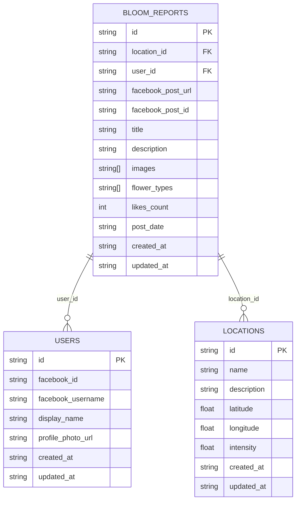

- Supabase integration is located in `src/integrations/supabase/`.
- `client.ts` initializes the Supabase client for database access.
- The Supabase project URL is `https://dxrlkykphghgwcqcflbs.supabase.co`.
- The app uses a public anon key for client-side access, with permissions controlled by Supabase RLS.
- The connection is tested and confirmed to work.
- The database contains the following tables: `bloom_reports`, `locations`, `users`, `flowers`, `flowers_per_location`, `flower_location_reactions`.
- Table schemas are defined in `src/integrations/supabase/types.ts` and include fields for reports, locations, users, flowers, flower-location mapping, and reactions.
- All CRUD operations in the app use the Supabase client for database interaction.
- The database is managed and hosted by Supabase, with access via RESTful API and client SDK.
- Supabase types are used for type safety in service and data layers.
- The database schema is defined in `src/integrations/supabase/types.ts`.
- The latest Supabase types are also available in `memory-bank/supabase_types_latest.ts` for up-to-date reference when inserting or updating DB data.
- All main tables include `created_at` and `updated_at` timestamps for record tracking.
- Key relationships:
  - `bloom_reports` references `locations` (via `location_id`) and `users` (via `user_id`).
  - `flowers_per_location` references `flowers` and `locations`.
  - `flower_location_reactions` references `flowers` and `locations`.
- The schema defines several functions and triggers for calculating and updating flower/location intensity:
  - `calculate_flower_intensity(flower_id, location_id)`
  - `update_flower_intensity_on_reaction()` (triggered on `flower_location_reactions` changes)
  - `update_location_intensity()` (triggered on `bloom_reports` and `flowers_per_location` changes)
- Row Level Security (RLS) is enabled on all main tables, with policies for public read access and authenticated user write access.
- The schema does not define enums or composite types, but uses check constraints for some fields (e.g., reaction_type).
- All table operations (insert, update, select) are strongly typed for safety.
- The upsert-flowers script now fetches and lists all flowers that are actually visible on the map (i.e., have locations and intensity > 0 in flowers_per_location), and prints their bloom months and intensity. This ensures the DB and UI are in sync for flower visibility.

---

### Database ER Diagram (2025-06-14)

```mermaid
erDiagram
  USERS {
    uuid id PK
    text facebook_id UNIQUE
    text facebook_username
    text display_name
    text profile_photo_url
    timestamptz created_at
    timestamptz updated_at
  }
  LOCATIONS {
    uuid id PK
    text name
    text description
    numeric latitude
    numeric longitude
    numeric intensity
    timestamptz created_at
    timestamptz updated_at
  }
  FLOWERS {
    uuid id PK
    text name UNIQUE
    text icon_url
    text description
    text bloom_season
    int bloom_start_month
    int bloom_end_month
    int bloom_start_day
    int bloom_end_day
    timestamptz created_at
    timestamptz updated_at
  }
  BLOOM_REPORTS {
    uuid id PK
    uuid location_id FK
    uuid user_id FK
    text facebook_post_url
    text facebook_post_id
    text title
    text description
    text[] images
    text[] flower_types
    int likes_count
    timestamptz post_date
    timestamptz created_at
    timestamptz updated_at
  }
  FLOWERS_PER_LOCATION {
    uuid id PK
    uuid location_id FK
    uuid flower_id FK
    numeric intensity
    timestamptz last_updated
    timestamptz created_at
    timestamptz updated_at
  }
  FLOWER_LOCATION_REACTIONS {
    uuid id PK
    uuid flower_id FK
    uuid location_id FK
    text user_ip
    text reaction_type (like/dislike)
    timestamptz created_at
  }
  BLOOM_REPORTS ||--o{ USERS : "user_id"
  BLOOM_REPORTS ||--o{ LOCATIONS : "location_id"
  FLOWERS_PER_LOCATION ||--o{ FLOWERS : "flower_id"
  FLOWERS_PER_LOCATION ||--o{ LOCATIONS : "location_id"
  FLOWER_LOCATION_REACTIONS ||--o{ FLOWERS : "flower_id"
  FLOWER_LOCATION_REACTIONS ||--o{ LOCATIONS : "location_id"
```

---

#### Functions & Triggers
- `calculate_flower_intensity(flower_id, location_id)`: Computes intensity based on reports, likes, and reactions.
- `update_flower_intensity_on_reaction()`: Triggered on reaction changes, updates `flowers_per_location` intensity.
- `update_location_intensity()`: Triggered on report or flower-location changes, updates `locations` intensity.

#### RLS Policies (Summary)
- Public (anon) can read all main tables.
- Anyone can add flower reactions.
- Authenticated users can create reports, manage flowers, flowers_per_location, and locations.
- Users can update their own reports and reactions, and manage their own profile.

#### Constraints
- Uniqueness enforced on key fields (e.g., flower name, user facebook_id).
- Check constraints on intensity fields and reaction_type.

#### Notes
- No enums or composite types are defined.
- All relationships are enforced with foreign keys and ON DELETE CASCADE where appropriate.
- All main tables have RLS enabled.

---

### Database ER Diagram

